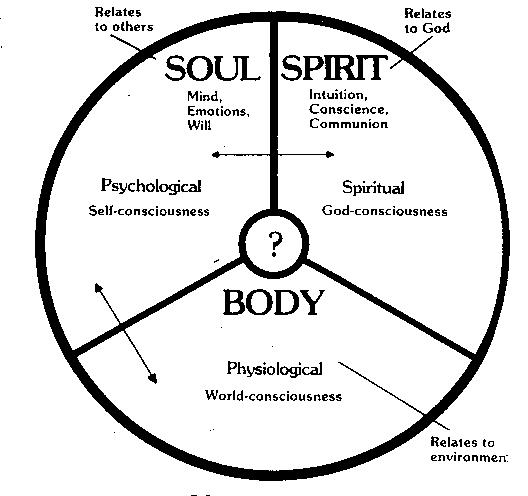
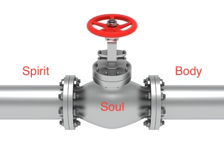

# Functions of Spirit, Soul and Body

## Basic functions
* Body - World conscious using the 5 senses
* Soul - Self conscious through intellect, emotions, etc
* Spirit - God conscious to communicate, serve and worship the Creator

## Onion architecture

## Functional Pipeline
We could also view soul as the middle man who can communicate with both the spiritual and physical realm through spirit and body respectively.

**Lk 1: 46, 47**
> And Mary said: "My soul glorifies the Lord. And my spirit has rejoiced in God my Savior.

**Inferences**

* Soul glorifies (present tense). Spirit has rejoiced (perfect tense). Spirit must exult before the soul can magnify.

