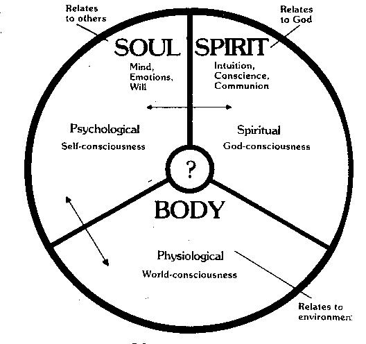
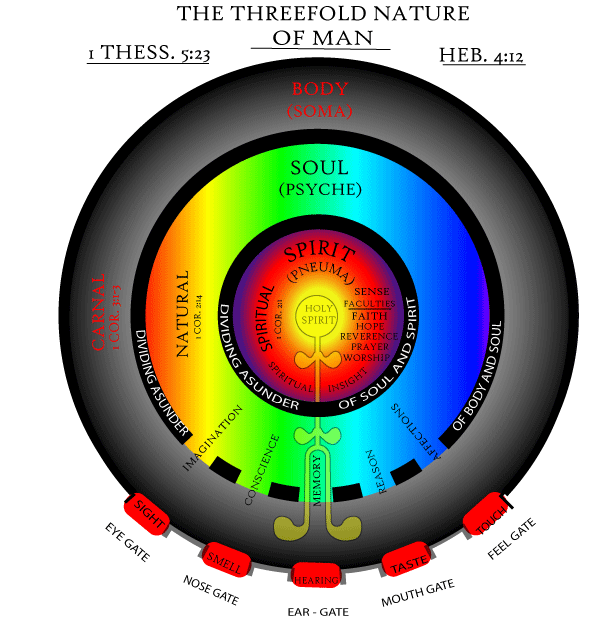
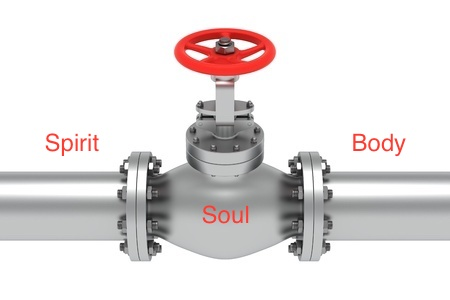

# Functions of Spirit, Soul and Body

* Body - World conscious using the 5 senses
* Soul - Self conscious through intellect, emotions, etc
* Spirit - God conscious to communicate, serve and worship the Creator

We could also view soul as the middle man who can communicate with both the spiritual and physical realm through spirit and body respectively.

**Lk 1: 46, 47**
> And Mary said: "My soul glorifies the Lord. And my spirit has rejoiced in God my Savior.

**Inferences**

* Soul glorifies (present tense). Spirit has rejoiced (perfect tense). Spirit must exult before the soul can magnify.

## Yet to validate

* Soul is the seat of personality; man's will, intellect, and emotion
* According to God's design the hierarchy is Spirit, Soul and Body. 
* Duty of the soul is to maintain the above order but it has been given 'free will' to choose what it wants - to obey the spirit or rebel joining hands with the body
* Before man fell, spirit controlled the being by communicating with the soul and the soul activated the body to follow the order of the spirit as spirit cannot directly control the body.

